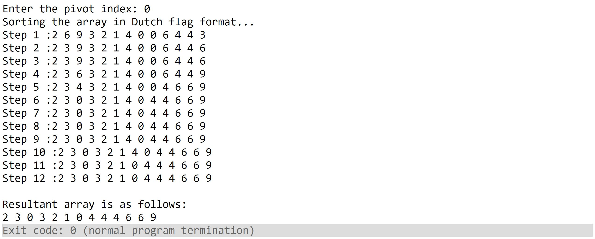

# Dutch National Flag Problem
#### Author: Sai Prajwal Kotamraju

Code can be found [here](10-dutch-national-flag-problem.cpp). The output by running the supplied code is shown in the figure. Please take a moment and analyze what is happening in each step if you don't understand what is happening in the code.
